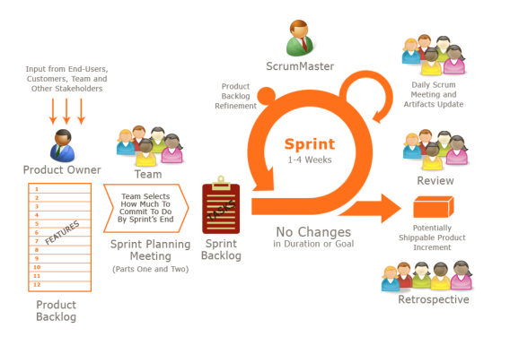

# 传统开发
### 瀑布模型

优点：

    瀑布模型中把开发过程细分成多个步骤, 每个人各司其职,
    开发人员只需按照文档完成需求即可

缺点：

    - 需要编写过多的文档
    - 开发周期长,每个步骤都需要等待上一个步骤完成后才可
    以开展工作
    - 需求响应慢,每有一个新需求,都需要完整地走一遍流程
    - 用户没有参与开发过程,不能很好地知道开发出来的产品
    有没有符合客户的要求
    
    

# 敏捷开发

### 敏捷开发是什么
敏捷开发不是一套明确的流程,也不是一种方法或者工具,敏捷开发是遵循着敏捷宣言的一种思想, 所有遵循这种思想的实践都可以称为敏捷开发.

敏捷开发的核心思想：**以人为本，专注交付对
客户有价值的软件。在高度协作的环境中，使用迭代式的
方式进行增量开发，经常根据反馈进行思考、反省和总结
，不停地自我调整和完善，让软件开发与交付轻量而敏捷。**

##### 敏捷宣言
- 个体和互动 高于 流程和工具
- 工作的文件 高于 详尽的文档
- 客户合作 高于 合同谈判
- 响应变化 高于 遵循计划

### 敏捷开发怎么做
敏捷开发是一种思想, 那么XP(极限编程), Scrum, DSDM等就是这种思想具体的实践

#### XP
XP是一种使用于在需求不明,或快速多变的情况下进行软件开发的轻量级方法学,其核心价值观为：
- 简单：只做必做的、最小设计、持续重构
- 沟通：及时有效，目的是一起创造最好的解决方案
- 反馈：严重承诺，尽快交付，认真听取反馈并及时改进
- 尊重：互相尊重，通过努力工作获得认同
- 勇气：如实反馈进展和预估，不为没完成的计划找借口，
勇于根据根据情况随时调整工作方式

XP的核心实践：
- Whole Team: 用户参与到开发团队, 协作开发更好地开发出用户所需要的功能
- Planning Game：用户通过用户故事提出需求,开发人员作出发布计划和迭代计划并作出承诺如期完成任务
- Customer Test：验收测试, 由客户来检验系统是否完成了既定的功能
- Small Releases：最小发布, 即每开发出一个可正常工作的功能就可以发布
- Collective Code Ownership： 集体代码所有权, 项目中的每个人都可以看到项目完整的代码
- Coding Standards：编码风格统一
- Sustainable Pace: 可持续的开发速度
- Metaphor：全项目命名风格统一
- Continuous Integration：连续整合
- Test-driven development：测试驱动开发,编写覆盖率高的测试用例
- Simple Design：用最简单的设计来完成工作
- Refactoring：重构,去掉冗余代码,提高代码质量
- Pair Programming：结对编程, 由两个程序员完成同一个需求, 可以再实现功能的同时review代码

#### Scrum

由用户提起需求, 产品经理分析用户需求做出产品订单后, 进行冲刺计划会议, 制定每次冲刺需要完成的需求, 而一次冲刺的周期为3-4周,在冲刺过程中,成员自由领取冲刺订单,冲刺订单中包含着细化后的需求信息.冲刺期间每日都要召开站立会议,成员们各自讲述自己昨天你完成了哪些工作?今天你打算做什么?完成你的目标是否存在什么障碍?而在冲刺结束后, 同样会有冲刺回顾会议,会议上所有成员对这次会议进行反思

#### XP VS Scrum
XP相对于Scrum：
- 迭代周期: XP迭代周期为1-2周, Scrum迭代周期为3-4周
- 应付新需求: 在XP中, 有限制地允许用户更改需求, 而Scrum中则不允许这样做, 一旦需求确定, 不可更改
- 开发过程: 在开发过程中, XP严格按照需求的优先级来开发, 而Scrum可以不按照需求优先级开发
- 实施规范: Scrum实施的过程中, 并没有规定采用XP中要求的结对编程、TDD、简单设计等行为

#### 精益
拉动式生产, 即当有需求的时候才开始生产, 这样做可以避免资源浪费,
自动化生产, 提高生产的效率

### 为什么要使用敏捷开发
在传统瀑布式开发的过程中存在的问题：
- 项目文档繁重, 在编写文档上花费了过多的时间
- 用户对开发进度一无所知

而在XP和Scrum中我们可以发现其共同点, 这也是敏捷开发的优势：
- 持续集成, 产品一直处于可运行状态, 而开发人员只进行增量开发
- 开发前, 不需要编写太多的文档

### 总结
并不是说敏捷开发就一定要比传统的瀑布式开发要好, 只能说各有所长, 而敏捷开发更适用于当前的软件开发当中.

敏捷开发结合到自身工作中：

项目：ELK日志收集

需求：
- 开发：可以看到系统日志, 用于发现,修复问题
- 老板：可以看到系统的访问量, 查询的响应时间的信息

计划：
- 搭建环境, 耗时0.5天
- 收集系统日志, 耗时0.5天
- 分析系统日志, 耗时0.5天

> 搭建环境时, 需要开发参与, 日志具体是在那台机器上, 并到对应的机器上安装所需软件.

完成搭建环境时就可以向老板和开发展示,环境已经搭建完, 下一步是收集日志

> 这时又需要开发提供日志的目录, 以供收集, 并编写相应的使用文档, 给开发和老板使用

当收集完成后, 这时开发的需求已经完成, 可以让开发进行测试, 看看对日志收集功能是否满意, 是否有其他需求, 如果没有其他需求, 那么可以进行到下一步,分析日志

> 分析日志期间需要老板和开发的共同参与, 老板提供具体想要看到的信息, 开发方面可能需要修改日志格式,然后进行分析得出报表

这时整个搭建完成, 只完成了开发和老板所需要的功能, 每完成1个步骤都向老板和开发反馈, 用户参与到了搭建过程中, 有新需求或者需求做的不对时, 能够很快的得到反馈并作出调整

瀑布式开发模式结合到公司管理：

相对于一个创业公司,很多工作有时候并没有规范到位, 这就需要有一套完整流程规范来让别人遵守, 花费一段时间来制定一套规范标准, 比每次遇到问题各成员间不知如何合作, 不知道自己应该负责什么部分要好

